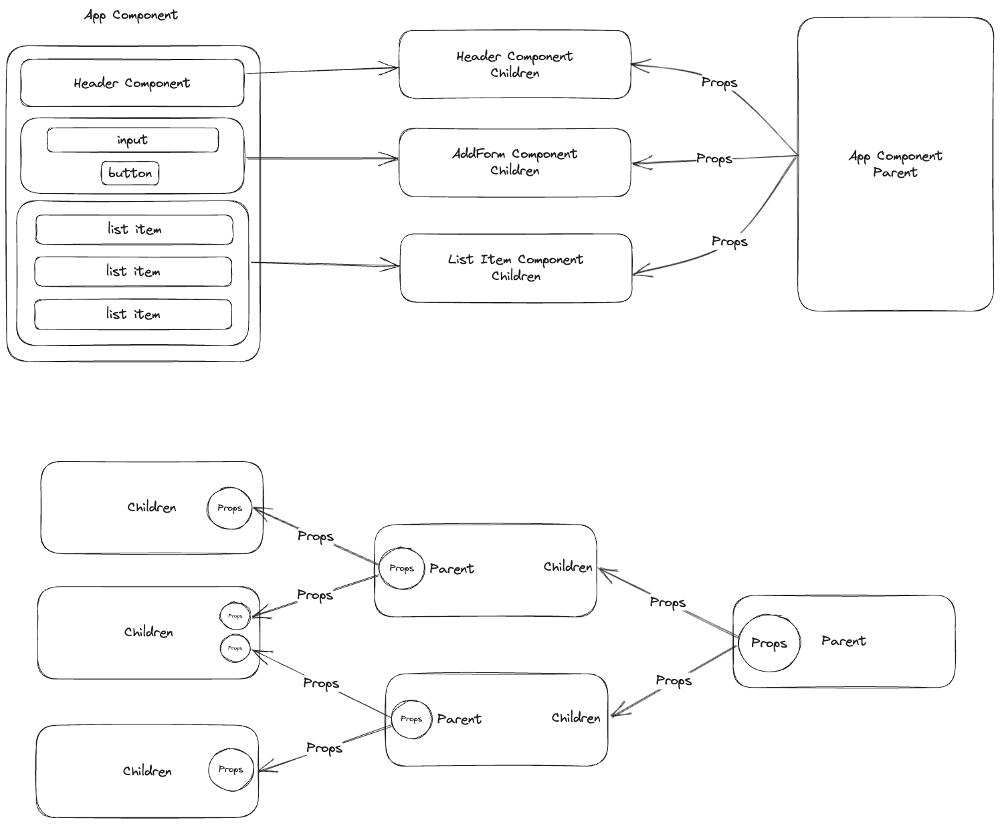
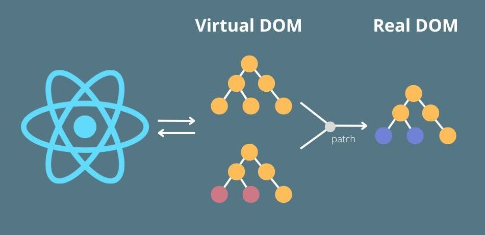

# React Props Tutorial

Props ကို component တစ်ခုနဲ့ တစ်ခုကို data passing လုပ်ချင်တဲ့ အခါတွေမှာ အသုံးပြုပါတယ်။ Props ကို အသုံးပြုတဲ့ အခါမှာလည်း **Parent Component** ကနေ **Children Component** ကိုပဲ ပို့လို့ရပါတယ်။ Props သည် **immutable** ဖြစ်တာကြောင့် data ကို ပြောင်းလို့ ရမှာ မဟုတ်ပါဘူး။ အဲ့ဒါကြောင့်လည်း State ထဲက Data ကိုပြောင်းလဲ ချင်တဲ့အခါမှာလည်း Parent Component မှာ `setState` function တွေရေးပြီးတဲ့အခါမှ function တွေအနေနဲ့ Props ကို ပို့ကြပါတယ်။ Children Component ကနေ Parent component ကို Props ပို့လို့မရဘူးဆိုပေးမယ် Function ရဲ့ parameter အနေနဲ့ parent component မှာ လက်ခံပြီးတော့ children component ကနေ parameter အနေနဲ့ ပို့လို့ရပါတယ်။ ထိုကဲ့သို့ ပို့တာသည် props မဟုတ်ပဲ function ရဲ့ parameter တစ်ခုပဲ ဖြစ်ပါတယ်။

## Props Diagram



ကဲဒါဆို Code လေးတွေနဲ့ တွဲပြီးတော့ လေ့လာကြည့်ရအောင်။

### Class Component

```javascript
import React from "react";

class Header extends React.Component {
  render() {
    return <h1>{this.props.title}</h1>;
  }
}

class App extends React.Component {
  render() {
    return (
      <div>
        <Header title="Todo List" />
        <AddForm />
      </div>
    );
  }
}

export default App;
```

### Functional Component

```javascript
import React from "react";

const Header = (props) => {
  return <h1>{props.title}</h1>;
};

const App = () => {
  return (
    <div>
      <Header title="Todo List" />
      <AddForm />
    </div>
  );
};

export default App;
```

အပေါ်က code တွေကို ကြည့်မယ်ဆိုရင် Header Component သည် App Component ရဲ့ Children ဖြစ်ပါတယ်။ အဲ့ဒါကြောင့် App Component ကနေပြီးတော့ Header Component ကို title ဆိုတဲ့ props တစ်ခုကို ပို့လိုက်ပါတယ်။ Header Component ကနေပြန်ခေါ်သုံးတဲ့ အခါမှာလည်း props ဆိုတဲ့ keyword လေးကို ခံပြီးတော့ `props.title` ဆိုပြီးတော့ ပြန်ခေါ်သုံးရပါတယ်။ အကယ်၍ props ဆိုတဲ့ keyword မခံချင်ပဲ props ကို Destructuring လုပ်ချင်ရင်လည်း ယခုလိုလုပ်ပြီးတော့လည်း သုံးလို့ရပါတယ်။

## Destructuring (Props)

### Class Component

```javascript
class Header extends React.Component {
  render() {
    const { title } = this.props;

    return <h1>{title}</h1>;
  }
}
```

### Functional Component

- Method 1

```javascript
const Header = ({ title }) => {
  return <h1>{title}</h1>;
};
```

- Method 2

```javascript
const Header = (props) => {
  const { title } = props;

  return <h1>{title}</h1>;
};
```

Props တွေကို Destructuring လုပ်တဲ့အခါမှာလည်း props တွေသည် **Object DataType** တွေဖြစ်တဲ့အတွက်ကြောင့် object destructuring လုပ်တဲ့နည်းအတိုင်းပဲ လုပ်ရမှာဖြစ်ပါတယ်။ ပထမ Method ကတော့ function ရဲ့ parameter မှာပဲ destructuring လုပ်သွားတာ ဖြစ်ပြီးတော့ ဒုတိယနည်းကတော့ variable တစ်ခုအနေနဲ့ initial လုပ်ပြီးတော့ destructuring လုပ်သွားတာပဲဖြစ်ပါတယ်။ Class Component တွေမှာလည်း ဒုတိယနည်းအတိုင်းပဲ destructuring လုပ်တာပဲ ဖြစ်ပါတယ်။ Class Component တွေမှာ သတိထားရမှာက render method ထဲမှာပဲ destructuring လုပ်ရမှာပဲဖြစ်ပါတယ်။ ဒါဆိုရင် Props Destructuring လုပ်တာကို သဘောပေါက်လောက်မယ်ထင်ပါတယ်။

## Passing State and Looping

### Class Component

```javascript
import React from "react";

class Header extends React.Component {
  render() {
    return <h1>{this.props.title}</h1>;
  }
}

class ListItem extends React.Component {
  render() {
    const { todos } = this.props;
    return (
      <div>
        {todos.map((todo) => {
          return <h1 key={todo.id}>{todo.title}</h1>;
        })}
      </div>
    );
  }
}

class App extends React.Component {
  constructor(props) {
    super(props);
    this.state = {
      todos: [
        { id: 1, title: "have to go" },
        { id: 2, title: "have to eat" },
      ],
    };
  }

  render() {
    return (
      <div>
        <Header title="Todo List" />
        <ListItem todos={this.state.todos} />
      </div>
    );
  }
}

export default App;
```

### Functional Component

```javascript
import React, { useState } from "react";

const Header = (props) => {
  return <h1>{props.title}</h1>;
};

const ListItem = ({ todos }) => {
  return (
    <div>
      {todos.map((todo) => {
        return <h1 key={todo.id}>{todo.title}</h1>;
      })}
    </div>
  );
};

const App = () => {
  const [todos, setTodos] = useState([
    { id: 1, title: "have to go" },
    { id: 2, title: "have to eat" },
  ]);

  return (
    <div>
      <Header title="Todo List" />
      <ListItem todos={todos} />
    </div>
  );
};

export default App;
```

အပေါ်က code တွေကို ကြည့်မယ်ဆိုရင် ListItem component သည် App component ရဲ့ children ဖြစ်ပါတယ်။ အဲ့ဒါကြောင့်လည်း App Component ရဲ့ State ထဲမှာရှိတဲ့ todos ဆိုတဲ့ Array တစ်ခုကို ListItem component ကို props အနေနဲ့ data passing လုပ်ပေးလိုက်တာဖြစ်ပါတယ်။ ListItem component မှာလည်း Props destructuring လုပ်ပြီးတော့ ပြန်ခေါ်သုံးထားပါတယ်။ ယခုလိုသုံးတာတွေက Destructuring လုပ်တဲ့ သဘောတရားကို အကျွမ်းတဝင်ရှိအောင်လို့ပဲ ဖြစ်ပါတယ်။ ListItem မှာ todos ကို Looping လုပ်တဲ့ အခါမှာလည်း array method တွေဖြစ်တဲ့ (map, forEach) တို့ကို အသုံးများပါတယ်။ မဖြစ်မနေသိထားရမှာက Looping လုပ်ပြီးတိုင်းမှာ **top(root) level element** မှာ key ဆိုတဲ့ props ကို မဖြစ်မနေ ထည့်ပေးဖို့လိုအပ်ပါတယ်။ Key ပေးတဲ့အခါမှာလည်း unique value ဖြစ်ဖို့လည်း အရေးကြီးပါတယ်။ ဒီလောက်ဆိုရင်တော့ looping လုပ်တဲ့ သဘောတရားကို နားလည်မယ်လို့ထင်ပါတယ်။

## Why each element in a list should have a unique key?

react မှာ key အကြောင်းပြောရရင် render လုပ်တဲ့ ပုံစံကိုပါ သိထားဖို့လိုအပ်ပါတယ်။ React သည် Virtual-DOM နဲ့ အလုပ်လုပ်ပါတယ်။

ဒါဆိုရင် Virtual-DOM ကရော ဘာလဲ။ Virtual-DOM ကဘယ်လို အလုပ်လုပ်ပေးတာလဲ။

Virtual-DOM က Browser ပေါ်မှာ ဖော်ပြထားတဲ့ DOM-Tree နဲ့ပုံစံတူ Object တစ်ခုကို တည်ဆောက်ထားတယ်။ ကျတော်တို့ element (or) component တွေကို ပြောင်းလဲလိုက်တဲ့အခါမှာ DOM-Tree နဲ့ပုံစံ Object တစ်ခုကို ထပ်ထုတ်တယ်။ အဲ့အခါမှ နဂိုရှိပြီးသား object နဲ့ ထပ်ထုတ်ထားတဲ့ object နှစ်ခုကို တိုက်စစ်ပြီးတော့ ပြောင်းသွားတဲ့ နေရာလေးတွေကိုပဲ ထပ်ဖြည့်ပြီးတော့ browser ပေါ်မှာ ပြင်ပြီးတော့ လာဖော်ပြတာပဲ ဖြစ်ပါတယ်။ အဲ့ဒါကြောင့် array element တွေကို re-render လုပ်တဲ့အခါမှာ unique ဖြစ်တဲ့ value တွေကို key အဖြစ်နဲ့ ထည့်ပေးရတာဖြစ်ပါတယ်။



---

## Passing Function with props

### Class Component

```javascript
import React from "react";

class Header extends React.Component {
  render() {
    return <h1>{this.props.title}</h1>;
  }
}

class ListItem extends React.Component {
  render() {
    const { todos } = this.props;
    return (
      <div>
        {todos.map((todo) => {
          return <h1 key={todo.id}>{todo.title}</h1>;
        })}
      </div>
    );
  }
}

class AddForm extends React.Component {
  render() {
    return (
      <div>
        <input type="text" placeholder="Enter New Task" />
        <button onClick={this.props.addHandler}>Add Task</button>
      </div>
    );
  }
}

class App extends React.Component {
  constructor(props) {
    super(props);
    this.state = {
      todos: [
        { id: 1, title: "have to go" },
        { id: 2, title: "have to eat" },
      ],
    };
  }

  addTodoHandler = () => {
    const id = this.state.todos.length + 1;

    this.setState({
      todos: [...this.state.todos, { id, title: "Have to go" }],
    });
  };

  render() {
    return (
      <div>
        <Header title="Todo List" />
        <AddForm addHandler={this.addTodoHandler} />
        <ListItem todos={this.state.todos} />
      </div>
    );
  }
}

export default App;
```

### Functional Component

```javascript
import React, { useState } from "react";

const Header = (props) => {
  return <h1>{props.title}</h1>;
};

const ListItem = ({ todos }) => {
  return (
    <div>
      {todos.map((todo) => {
        return <h1 key={todo.id}>{todo.title}</h1>;
      })}
    </div>
  );
};

const AddForm = ({ addHandler }) => {
  return (
    <div>
      <input type="text" placeholder="Enter New Task" />
      <button onClick={addHandler}>Add Task</button>
    </div>
  );
};

const App = () => {
  const [todos, setTodos] = useState([
    { id: 1, title: "have to go" },
    { id: 2, title: "have to eat" },
  ]);

  const addTodoHandler = () => {
    const id = todos.length + 1;
    setTodos((prevState) => [...prevState, { id, title: "have to code" }]);
  };

  return (
    <div>
      <Header title="Todo List" />
      <AddForm addHandler={addTodoHandler} />
      <ListItem todos={todos} />
    </div>
  );
};

export default App;
```

ဒီအဆင့်မှာဆိုရင်တော့ AddForm component တစ်ခု ထပ်တိုးလာပါတယ်။ AddForm component ကို `addTodoHandler` ဆိုတဲ့ State ရဲ့ Data ကို change တဲ့ function တစ်ခုကို props အနေဖြင့် pass လုပ်ထားပါတယ်။ ဒီအဆင့်မှာဆိုရင်တော့ todos ထဲကို ထပ်ဝင်လာမယ့် data သည် default ရေးထားတာဖြစ်တဲ့အတွက်ကြောင့် `have to code` ဆိုတဲ့ string ပဲ ဝင်နေအုံးမှာဖြစ်ပါတယ်။ နောက်လာမယ့် အဆင့်တွေမှာတော့ data တွေကို dynamic ဖြစ်အောင်ရေးမှာပဲ ဖြစ်ပါတယ်။ အခု code တွေရဲ့ structure ကို ကြည့်မယ်ဆိုရင် **App component** မှာ **children** သုံးခုရှိပါမယ်။ ၎င်း children တွေကတော့

1. Header Component
2. AddForm Component
3. ListItem Component

တွေပဲ ဖြစ်ပါတယ်။

- Header Component မှာဆိုရင် props အနေနဲ့ `title` ဖြစ်တဲ့ string ကို လက်ခံထားပါတယ်။
- AddForm Component မှာဆိုရင် props အနေနဲ့ `addHandler` ဖြစ်တဲ့ function ကို လက်ခံထားပါတယ်။
- ListItem Component မှာဆိုရင် props အနေနဲ့ `todos` ဖြစ်တဲ့ Array ကို လက်ခံထားတာပဲ ဖြစ်ပါတယ်။

အခုဆိုရင် `todos` array ထဲမှာရှိတဲ့ `title` ကို input က ထည့်လိုက်တဲ့ value တွေကို ထည့်တဲ့ နည်းကို ပြောပြတော့မှာပဲ ဖြစ်ပါတယ်။ အထက်ကပြောပြသွားတဲ့ Component တိုင်းကို ပို့ထားတဲ့ props တွေကို သေသေချာချာလေး ကြည့်ပြီးတော့ မှတ်ပေးထားပါ။

## Passing addHandler Function with a parameter

### Class Component

```javascript
class AddForm extends React.Component {
  inputRef = React.createRef();

  onSubmitHandler = (e) => {
    e.preventDefault();
    this.props.addHandler(this.inputRef.current.value);
  };

  render() {
    return (
      <form onSubmit={this.onSubmitHandler}>
        <input ref={this.inputRef} type="text" placeholder="Enter New Task" />
        <button type="submit">Add Task</button>
      </form>
    );
  }
}

class App extends React.Component {
  constructor(props) {
    super(props);
    this.state = {
      todos: [
        { id: 1, title: "have to go" },
        { id: 2, title: "have to eat" },
      ],
    };
  }

  addTodoHandler = (value) => {
    const id = this.state.todos.length + 1;

    this.setState({
      todos: [...this.state.todos, { id, title: value }],
    });
  };

  render() {
    return (
      <div>
        <Header title="Todo List" />
        <AddForm addHandler={this.addTodoHandler} />
        <ListItem todos={this.state.todos} />
      </div>
    );
  }
}
```

### Functional Component

```javascript
const AddForm = ({ addHandler }) => {
  const inputRef = React.createRef();

  const onSubmitHandler = (e) => {
    e.preventDefault();
    addHandler(inputRef.current.value);
  };

  return (
    <form onSubmit={onSubmitHandler}>
      <input ref={inputRef} type="text" placeholder="Enter New Task" />
      <button type="submit">Add Task</button>
    </form>
  );
};

const App = () => {
  const [todos, setTodos] = useState([
    { id: 1, title: "have to go" },
    { id: 2, title: "have to eat" },
  ]);

  const addTodoHandler = (value) => {
    const id = todos.length + 1;
    setTodos((prevState) => [...prevState, { id, title: value }]);
  };

  return (
    <div>
      <Header title="Todo List" />
      <AddForm addHandler={addTodoHandler} />
      <ListItem todos={todos} />
    </div>
  );
};
```

ဒီအဆင့်မှာဆိုရင်တော့ AddForm component မှာ ပြောင်းလဲသွားတာတွေကတော့ form လို့ပြောင်းလိုက်ပါတယ်။ ဘာကြောင့်လဲဆိုတော့ submit လုပ်တာနဲ့ state ထဲက data ကို ပြောင်းချင်တဲ့ အတွက်ကြောင့်ပဲ ဖြစ်ပါတယ်။ App Component မှာ `addTodoHandler` function မှာ parameter အနေနဲ့ value ကို လက်ခံထားခဲ့ပြီးတော့ `addHandler` props အနေနဲ့ AddForm component ကို ပေးပို့လိုက်တာပဲ ဖြစ်ပါတယ်။ AddForm component ကနေမှတဆင့် `AddTodoHandler` function မှာ လက်ခံထားခဲ့ value ဆိုတဲ့ parameter နေရာကို `inputRef.current.value` ဖြစ်တဲ့ input ထဲမှာထည့်လိုက်တဲ့ စာတွေကို parameter အနေနဲ့ Parent Component ကို ပြန်ပို့ပေးလိုက်တာဖြစ်ပါတယ်။ ဒီနေရာမှာ တစ်ခုသတိထားစေချင်တာက App Component ကို props အနေနဲ့ ပြန်ပို့လိုက်တာ မဟုတ်ပါဘူး။ Function ရဲ့ parameter တစ်ခုအနေနဲ့သာ ပေးပို့လိုက်တာဖြစ်ပါတယ်။ ဒီလောက်ဆိုရင်တော့ props အကြောင်းကို နားလည်လိမ့်မယ်လို့မျှော်လင့်ပါတယ်။

## Splitting Component

### Project file structure

    .
    ├── assets
    ├── public
    ├── src
    │    ├── AddForm.js
    │    ├── App.css
    │    ├── App.test.js
    │    ├── BaseLayout.js
    │    ├── Components.js
    │    ├── Header.js
    │    ├── index.css
    │    ├── index.js
    │    ├── ListItem.js
    │    ├── logo.svg
    │    ├── reportWebVitals.js
    │    └── setupTests.js
    ├── .gitignore
    ├── package.json
    ├── tailwind.config.js
    ├── README.md
    └── yarn.lock
